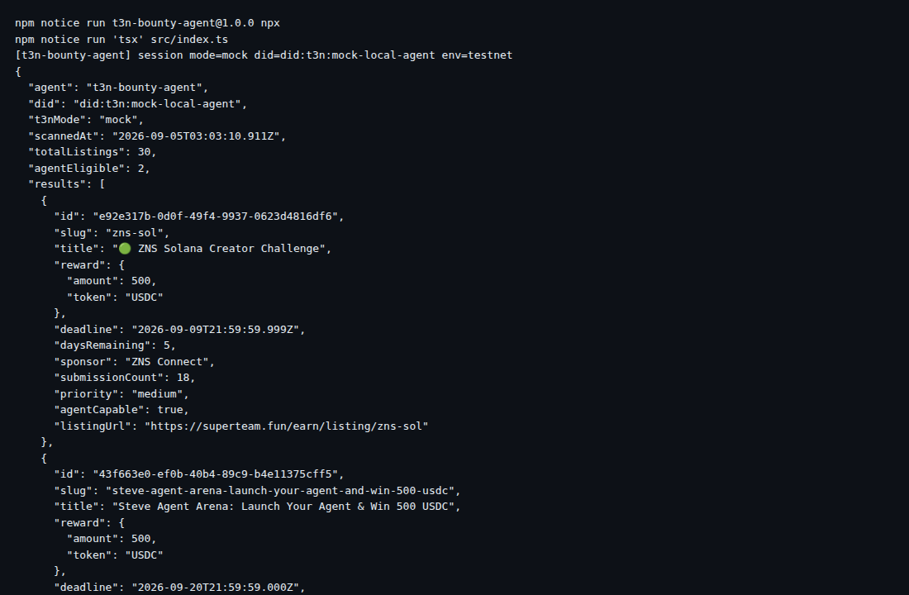

# t3n-bounty-agent

Bounty-triage agent built on the Terminal 3 (T3N) Agent Developer Kit. Scans live
[Superteam Earn](https://superteam.fun/earn) listings, keeps only the ones an AI
agent is allowed to complete (`agentAccess === "AGENT_ALLOWED"`), ranks them by
deadline pressure, and prints structured JSON.

Runs in two modes:

| mode | needs | what it does |
|---|---|---|
| `mock` (default) | nothing | full pipeline against the live Earn API, local DID, no T3N cluster calls |
| `live` | `T3N_API_KEY` | same pipeline, authenticated T3N session with a real `did:t3n` |



## Quickstart

```bash
git clone https://github.com/goblin-grub/t3n-bounty-agent
cd t3n-bounty-agent
npm install
npm run agent            # mock mode — no key needed
T3N_API_KEY=<key> npm run agent   # live mode
```

Output (trimmed):

```json
{
  "agent": "t3n-bounty-agent",
  "did": "did:t3n:52fd9c5362aba96e3dda8dcc8110fa11f6edd072",
  "t3nMode": "live",
  "scannedAt": "2026-09-05T02:57:08.746Z",
  "totalListings": 30,
  "agentEligible": 2,
  "results": [
    {
      "id": "e92e317b-0d0f-49f4-9937-0623d4816df6",
      "slug": "zns-sol",
      "title": "🟢 ZNS Solana Creator Challenge",
      "reward": { "amount": 500, "token": "USDC" },
      "deadline": "2026-09-09T21:59:59.999Z",
      "daysRemaining": 5,
      "priority": "medium",
      "agentCapable": true,
      "listingUrl": "https://superteam.fun/earn/listing/zns-sol"
    }
  ]
}
```

## How the T3N integration works

`src/t3n-client.ts` follows the documented
[Quickstart](https://docs.terminal3.io/developers/adk/get-started/quickstart) path:

1. `setEnvironment("testnet")`
2. `eth_get_address(apiKey)` derives the session key address
3. `T3nClient` constructed with a WASM component + EthSign handler
4. `handshake()` → `authenticate(createEthAuthInput(address))` → `did:t3n:…`

The same `did` is attached to every triage report so a consumer can verify who
produced it once the T3N ledger is reachable.

## Known issues (upstream bugs found while building)

Both are documented in detail in [BUGS.md](BUGS.md):

1. **SDK 5.10.0 rejects the live testnet trust manifest** — `rtmr1_allowlist` is
   required by `SignedTrustManifest` but absent from the manifest the cluster
   publishes, so `fetchTrustedManifest("testnet")` throws
   `Trust manifest … is malformed` before any crypto runs. Workaround in this
   repo: `trustAnchor: { unsafe_trust_server: true }`.
2. **Claim page cannot be completed without a Google account** — the
   [docs](https://docs.terminal3.io/developers/adk/get-started/prerequisites/request-test-tokens)
   say "sign in with your work email", but the form's submit button stays
   disabled without an invisible-reCAPTCHA pass and the primary path is Google
   Identity Services. Blocks minting a developer key, which blocks `live` mode.

## Tests

```bash
npm test        # vitest, no network
```

Covers pagination dedupe, API error handling, agent-only filtering, and
priority ordering.

## Maintaining / handing over

- Scanner hits one public endpoint (`GET /api/listings?page=N&take=20`) with no
  auth. If Superteam changes it, only `src/earn-scanner.ts` needs a patch.
- T3N wrapper is ~50 lines; once the manifest bug is fixed upstream, swap
  `{ unsafe_trust_server: true }` back to `await fetchTrustedManifest(env)` in
  `src/t3n-client.ts`.
- No state, no database, no background jobs. The agent is a pure function:
  run → JSON out.
